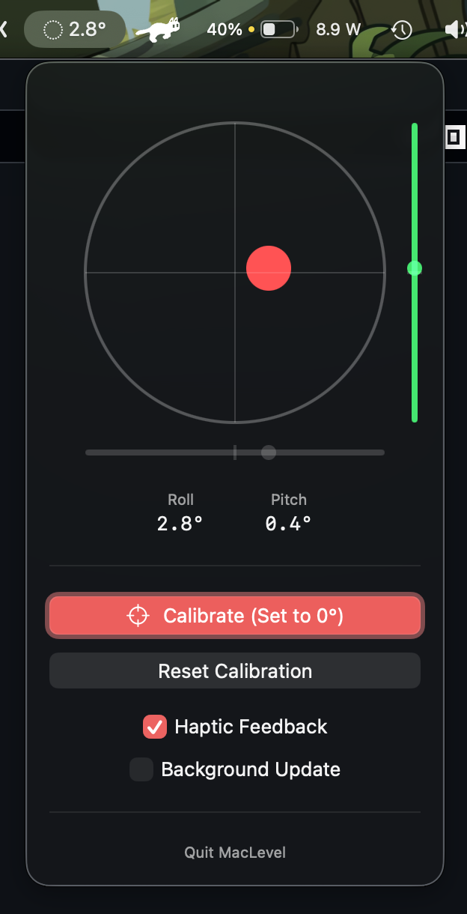

# MacLevel

[](https://github.com/ny0510/MacLevel/releases)
[](https://github.com/ny0510/MacLevel/actions)
[](https://github.com/ny0510/MacLevel/releases)

최신 MacBook에 내장되어 있는 자이로스코프 센서를 활용하여 기기의 기울기를 측정하는 간단한 수평계 앱입니다.



## 설치

### Homebrew

```bash
brew tap ny0510/tap
brew install --cask maclevel
```

### 직접 다운로드

1. [릴리즈 페이지](https://github.com/ny0510/MacLevel/releases)에서 최신 버전을 다운로드하세요.
2. 다운로드한 `.zip` 파일의 압축을 풀고, `MacLevel.app`을 응용 프로그램 폴더로 이동하세요.

## 테스트 환경

- MacBook Pro 16" (2024, M4 Pro), macOS 26.3

## 라이센스

[AGPL-3.0](https://github.com/ny0510/MacLevel/blob/main/LICENSE)
